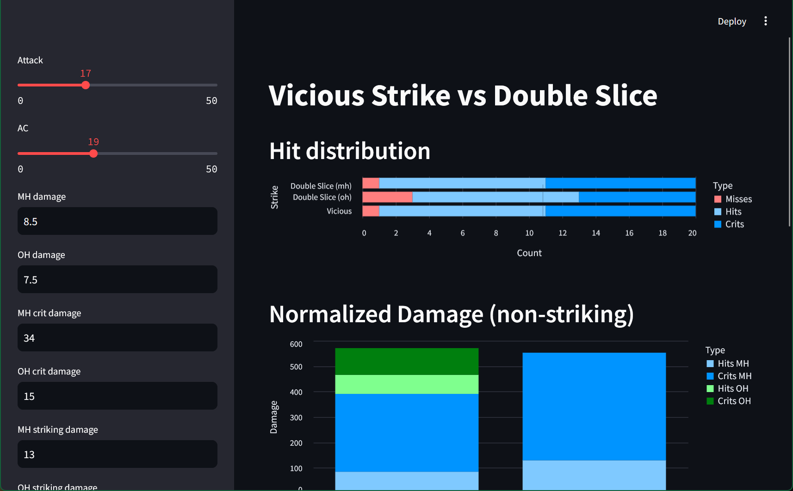

I wanted to see which feat between [Vicious Swing](https://2e.aonprd.com/Feats.aspx?ID=4775) and [Double Slice](https://2e.aonprd.com/Feats.aspx?ID=4769)
was better for a sword-and-board fighter in Pathfinder 2E for the strict purpose of fighting enemies with resistances (using either a bludgeoning weapon
or a slashing weapon with a shield augmentation giving Versatile S so the double slice damage is of a single type).

Turns out, Pathfinder's four degrees of success makes it very complicated to model mathematically -- certainly beyond my skills in statistics.The result:
this totally overkill project.

tldr: Double Slice is better until lv 9, from lv 10 and on Vicious Swing does more damage overall. However, Double Slice is more reliable -- is is less
likely that you will do 0 damage with it than with Vicious Swing.

## Pre-requisites

1. pipx (`$ python3 -m pip install pipx`)
2. poetry (`$ pipx install poetry`)

## Environment Setup

1. `$ poetry install`

## Running

1. `$ poetry shell`
2. `$ streamlit run ./vicious_vs_double_slice/Playground.py`

## Running unit tests

1. `$ poetry run pytest`
