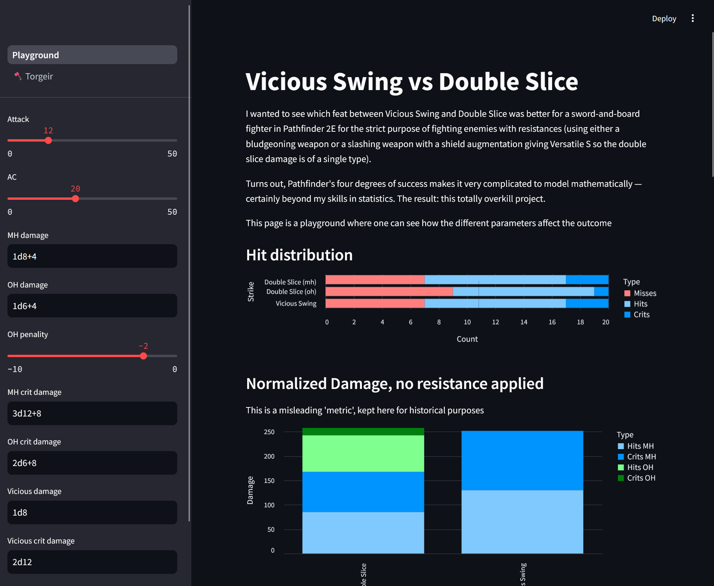

I wanted to see which feat between [Vicious Swing](https://2e.aonprd.com/Feats.aspx?ID=4775) and [Double Slice](https://2e.aonprd.com/Feats.aspx?ID=4769) was better for a sword-and-board fighter in Pathfinder 2E for the strict purpose of fighting enemies with resistances (using either a bludgeoning weapon or a slashing weapon with a shield augmentation giving Versatile S so the double slice damage is of a single type).

Turns out, Pathfinder's four degrees of success makes it very complicated to model mathematically -- certainly beyond my skills in statistics. The result: this totally overkill project.

I am not an experienced optimizer, so I am not sure if the "normalized" way of looking at damage is the best one; reliability might be a better metric.

## Pre-requisites

1. pipx (`$ python3 -m pip install pipx`)
2. poetry (`$ pipx install poetry`)

## Environment Setup

1. `$ poetry install`

## Running

1. `$ poetry shell`
2. `$ streamlit run ./vicious_vs_double_slice/app.py`

## Running unit tests

1. `$ poetry run pytest`

## Todo

- Support dice notation for damage fields
